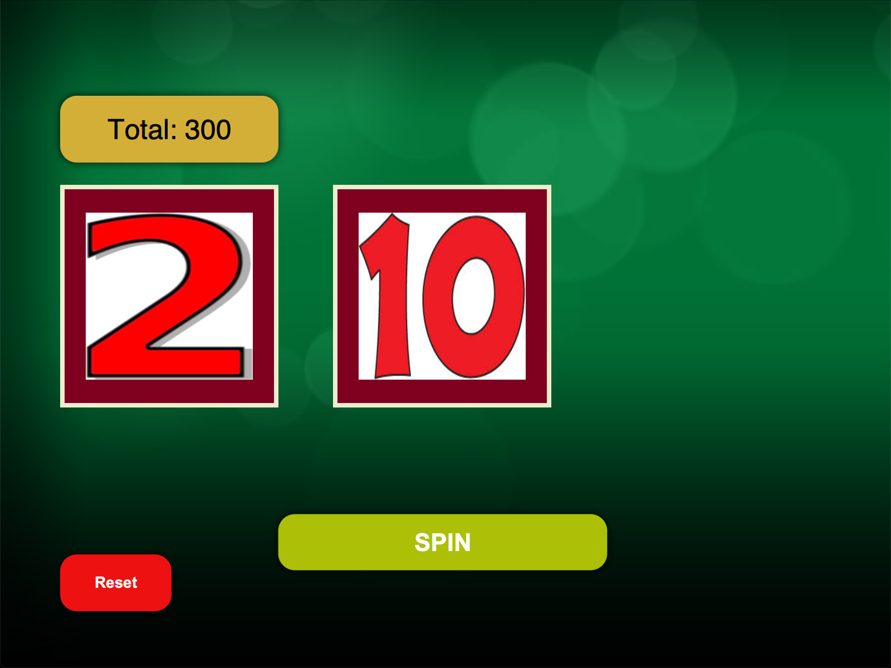
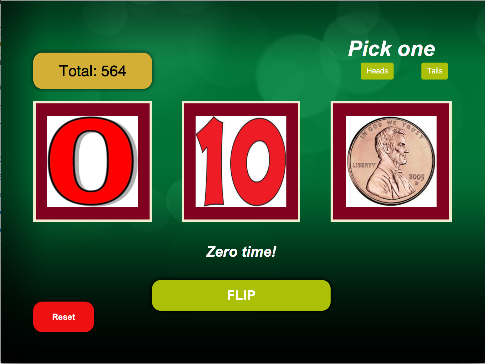

# Nought-Machine
Slot machine simulator of a game. 

To play, first you enter the amount of money you would like to start off with, then click the "submit" button. 

  

                                                 

That will take you to the following panel:

  

* The first reel represents values from -3 to 3, while the second has the discrete values 1, 10 and 100. 
* Your win and loss is based on the product of the value in reel one and the value in reel 2. 
  - So, for example, getting a 3 on the first reel and a 10 on the second ends up in winning 30. 
  - If the 3 was -3, then you would lose 30
  

  
* If a zero is obtained, such as below, you will have to flip a coin and choose heads or tails
* If you guess after flipping the coin, you break even. Else, you lose whatever's on the second reel. 

  
</p
